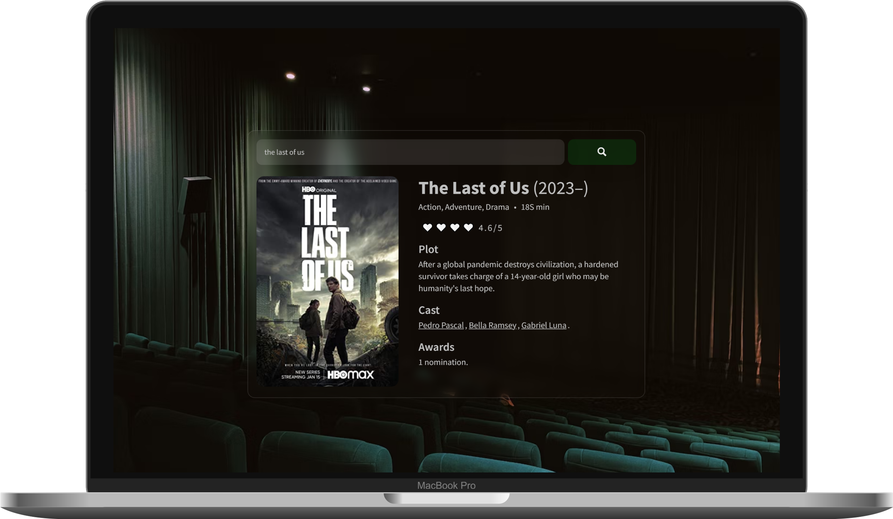

# movie-search-app 🎞
https://vitordefante.github.io/movie-search-app/ 🔗

A small project for practicing my JavaScript skills. 
The **[Movie Search App](https://vitordefante.github.io/movie-search-app/)** is a website that allows users to search for movies using the OMDB API.

## Screenshots

  
  

## Features
- Search for movies by title.
- View movie details, including poster, year, genre, and plot.
- Save movies to a favorites list.
- View a list of previously saved favorite movies.

## Examples
Here are a few examples of how you can use the Movie Finder website:

### Searching for movies
1. Go to the homepage.
2. Enter a movie title in the search bar and click "Search".
3. View the search results.
4. Click on a movie to view more details.

## Contributing
If you would like to contribute to the project, please follow these steps:

1. Fork the repository
2. Create a new branch for your feature or bug fix.
3. Make your changes.
4. Create a pull request.

## License
This project is licensed under the MIT License.

## Acknowledgments
The Movie Finder project uses the OMDB API to retrieve movie data. Special thanks to the creators of the OMDB API for providing this data.
